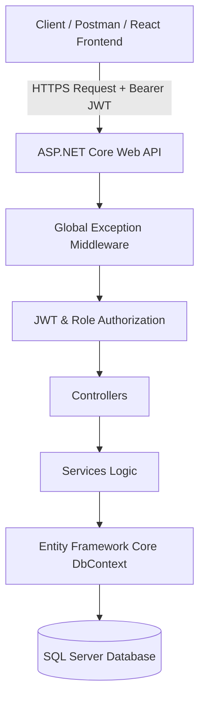
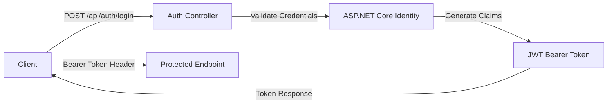
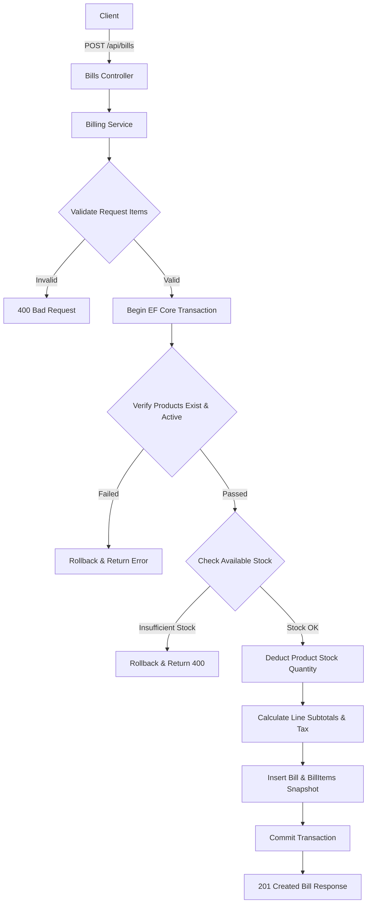

# Small Shop Inventory & Billing API

Production-ready backend RESTful API built with **.NET 8 Web API**, **ASP.NET Core Identity**, **JWT Authentication**, and **Entity Framework Core with SQL Server**.

Designed for small retail shop inventory management, role-based access control, itemized billing, historical tax/price snapshot tracking, atomic database transactions, optimistic concurrency control, global error handling, and containerized Docker execution.

---

## Architecture & Data Flow



---

## Authentication Flow



---

## Billing & Transaction Flow



---

## Features

* **JWT Authentication & Security**: Password hashing with ASP.NET Core Identity, JWT Bearer Token generation, and configurable expiration.
* **Role-Based Authorization**: Distinct policy rules for `Admin` and `Staff` roles across protected endpoints.
* **Product Management**: Full CRUD operations, SKU uniqueness enforcement, soft deactivation, string trimming/sanitization, and search by SKU or Name.
* **Inventory Control**: Real-time stock tracking, stock increases/decreases, low-stock threshold filtering, and strict non-negative stock guarantees.
* **Itemized Billing System**: Multi-product bill generation, historical unit price and tax rate snapshot preservation, line totals calculation, and server-generated invoice numbers (`INV-YYYY-XXXXXX`).
* **Atomic Transactions & Stock Deduction**: EF Core database transactions guarantee that stock deduction, bill insertion, and item line snapshots commit atomically or rollback completely on failure.
* **Optimistic Concurrency Control**: Entity Framework Core `RowVersion` timestamp token prevents race conditions and stock over-selling.
* **Global Error Handling & Validation**: Centralized exception middleware mapping domain exceptions (`NotFoundException`, `BadRequestException`, `ConflictException`) to structured JSON error responses with request correlation `traceId`.
* **Health Checks**: `GET /health` and `GET /api/health` endpoints verifying application status and SQL Server database connectivity.
* **Pagination**: Standardized `PagedResponse<T>` wrapper for products and bill summaries (`?page=1&pageSize=10`, max `pageSize=50`).
* **OpenAPI / Swagger Documentation**: Full interactive Swagger UI with XML comments and JWT Bearer authorization support.
* **Automated Testing Suite**: 30 comprehensive xUnit unit and integration tests covering business services, transaction atomicity, concurrency, and WebApplicationFactory endpoints.
* **Docker & Containerization**: Multi-stage `Dockerfile`, `docker-compose.yml` orchestrating API and SQL Server 2022 containers with health checks, environment secret substitution, persistent data volume, and private network bridge.

---

## Technology Stack

* **Language**: C# 12
* **Framework**: .NET 8 ASP.NET Core Web API
* **Database & ORM**: SQL Server, Entity Framework Core 8.0
* **Security & Auth**: ASP.NET Core Identity, System.IdentityModel.Tokens.Jwt
* **API Documentation**: Swashbuckle OpenAPI / Swagger UI
* **Testing Infrastructure**: xUnit, Moq, Microsoft.AspNetCore.Mvc.Testing, Microsoft.EntityFrameworkCore.InMemory
* **Containerization**: Docker, Docker Compose

---

## Getting Started

### Prerequisites

* [.NET 8 SDK](https://dotnet.microsoft.com/download/dotnet/8.0)
* [SQL Server](https://www.microsoft.com/sql-server/) or LocalDB
* [Git](https://git-scm.com/)

### Installation & Setup

1. **Clone the repository**:
   ```bash
   git clone https://github.com/your-username/SmallShopInventoryBillingAPI.git
   cd SmallShopInventoryBillingAPI
   ```

2. **Configure Database Connection**:
   Update `appsettings.json` with your SQL Server connection string:
   ```json
   "ConnectionStrings": {
     "DefaultConnection": "Server=localhost;Database=SmallShopInventoryDb;Trusted_Connection=True;TrustServerCertificate=True;"
   }
   ```

3. **Restore & Build Project**:
   ```bash
   dotnet restore
   dotnet build
   ```

4. **Apply Entity Framework Core Database Migrations**:
   ```bash
   dotnet ef database update
   ```

5. **Run the API Server**:
   ```bash
   dotnet run
   ```
   The API will be available at: `http://localhost:5206` (or `https://localhost:7080`).

---

## Docker Execution

### Prerequisites
* [Docker Desktop](https://www.docker.com/products/docker-desktop/)
* [Docker Compose](https://docs.docker.com/compose/)

### Configuration & Environment Setup
1. Copy `.env.example` to `.env`:
   ```bash
   cp .env.example .env
   ```
2. Update `.env` with your secure SQL Server password (`MSSQL_SA_PASSWORD`) and JWT secret (`JWT_KEY`).

### Build & Start Containers
Build the multi-stage image and start API & SQL Server containers:
```bash
docker compose up --build
```
Run in background mode:
```bash
docker compose up -d --build
```

### Access Container Endpoints
* **API Endpoint**: `http://localhost:8080`
* **Swagger UI**: `http://localhost:8080/swagger`
* **Health Check**: `http://localhost:8080/health`

### View Container Logs
```bash
docker compose logs api
```

### Stop Containers & Manage Data
Stop containers while preserving persistent database data (`sqlserver-data` volume):
```bash
docker compose down
```

Stop containers and permanently delete local database volume:
```bash
docker compose down -v
```
> [!WARNING]
> Running `docker compose down -v` permanently deletes local SQL Server database data stored in the persistent volume.

---

## API Documentation & Swagger UI

Once the application is running, open your web browser and navigate to:
```text
http://localhost:5206/swagger
```

### Swagger Bearer Authorization Steps:
1. Call `POST /api/auth/login` (or `POST /api/auth/register`).
2. Copy the returned JWT token string from the JSON response.
3. Click the **Authorize** button at the top right of the Swagger page.
4. Enter `Bearer <YOUR_JWT_TOKEN>` into the text box and click **Authorize**.
5. Test protected endpoints directly from Swagger UI.

---

## Automated Testing

Run the automated xUnit test suite (30 unit & integration tests):
```bash
dotnet test SmallShopInventoryBillingAPI.Tests/SmallShopInventoryBillingAPI.Tests.csproj --verbosity normal
```

---

## Postman Collection & Environment

Import the pre-configured Postman files located in the `Postman/` directory:
1. `Postman/SmallShopInventoryBillingAPI.postman_collection.json`
2. `Postman/SmallShopInventoryBillingAPI.postman_environment.json`

### Postman Usage:
1. Select the **SmallShopInventoryBillingAPI Environment**.
2. Run the **Login** request under the `Authentication` folder.
3. The test script automatically saves the returned JWT into the `{{token}}` environment variable.
4. Execute `Products`, `Inventory`, and `Billing` requests with automatic assertions verifying status codes, field properties, and total calculations (`totalAmount = subTotal + taxAmount`).

---

## License

This project is open-source and available under the [MIT License](LICENSE).
